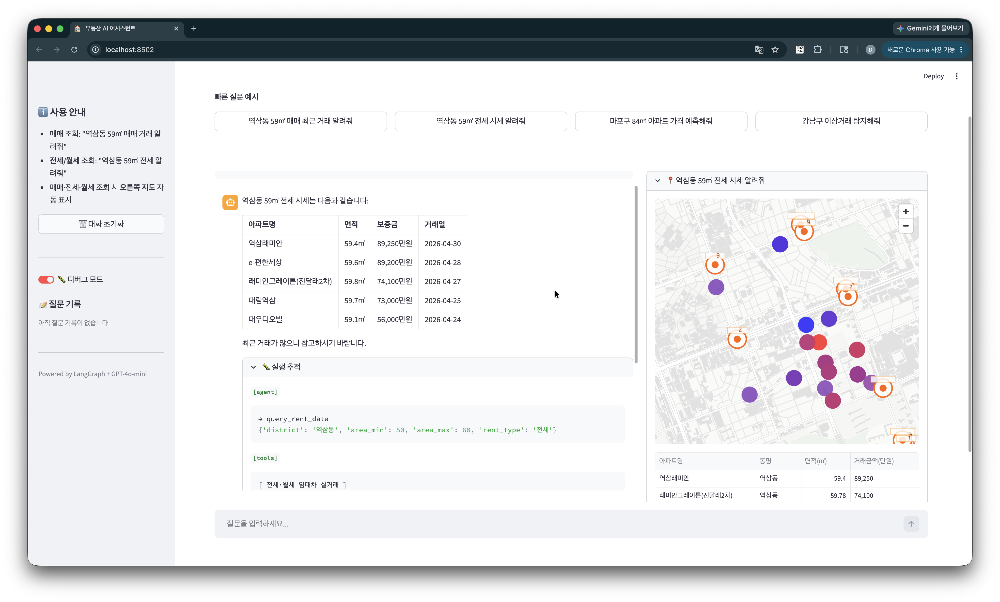
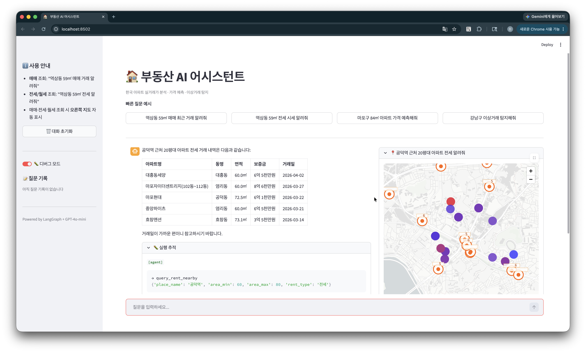
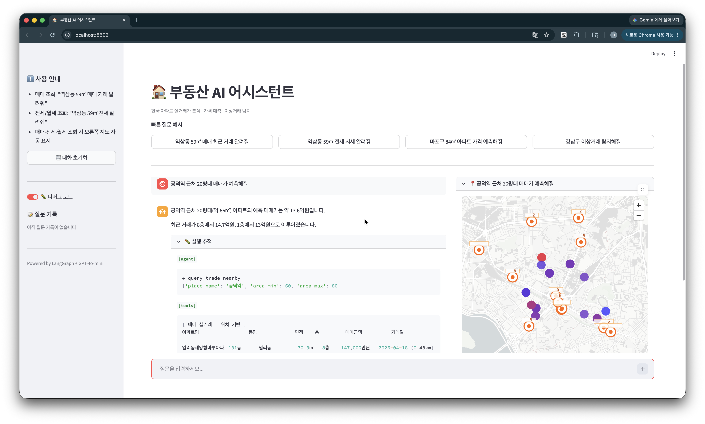
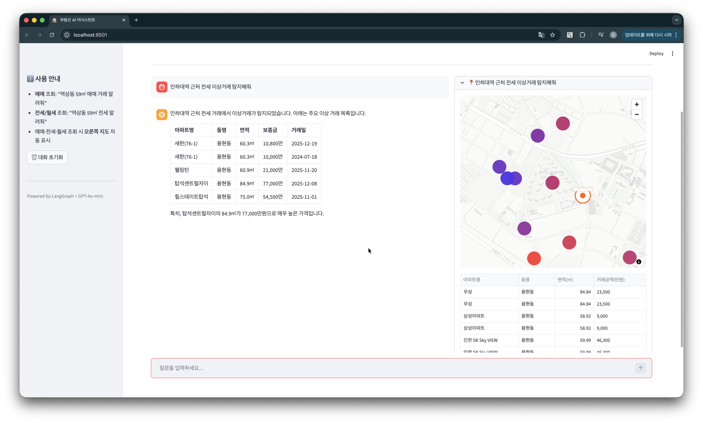

# 부동산 Agentic AI

> 한국 아파트 실거래가를 자연어로 조회하고, 가격 예측과 이상거래 탐지까지 제공하는 AI 어시스턴트.  
> 채팅 답변과 함께 거래 위치를 **지도에 자동 시각화**하는 것이 핵심 특징입니다.

연계 프로젝트 **[realestate](https://github.com/lh922j/realestate)** 에서 수집한 실거래 DB와 학습된 LightGBM 모델을 그대로 활용합니다.

---

## 스크린샷

| 전세 시세 조회 + 지도 | 근처 아파트 조회 |
|---|---|
|  |  |

| 가격 예측 | 이상거래 탐지 |
|---|---|
|  |  |

---

## 핵심 특징

- **채팅 + 지도 동시 제공** — 거래 조회 시 우측 패널에 위치 자동 표시. 가격에 따라 파랑(저) → 빨강(고)으로 색상 구분, Kakao API 연동 시 주변 지하철역도 오버레이
- **멀티턴 대화** — 이전 질문 맥락을 유지하며 대화. 여러 지역 조회 결과를 Expander로 누적 비교 가능
- **행정구역 + 랜드마크 모두 지원** — "역삼동"처럼 동/구 이름도, "강남역 근처"처럼 역·건물 이름도 인식
- **ML 분석 내장** — LightGBM 가격 예측(R² 0.714), Isolation Forest 이상거래 탐지를 자연어 한 마디로 실행

---

## 빠른 시작

### 사전 준비

[realestate](https://github.com/lh922j/realestate) 프로젝트에서 데이터 수집과 모델 학습을 먼저 완료해야 합니다.

```bash
# realestate/ 프로젝트에서 실행
python -m src.realestate.main collect --type trade --region 서울 --start 202201 --end 202604
python -m src.realestate.main collect --type rent  --region 서울 --start 202201 --end 202604
python -m src.realestate.main geocode
python -m src.realestate.main train --model lgbm --complex-split
```

### 설치

```bash
git clone https://github.com/lh922j/realestate_agent.git
cd realestate_agent

python -m venv .venv
source .venv/bin/activate  # Windows: .venv\Scripts\activate
pip install -e ".[dev]"

cp .env.example .env
# .env에서 OPENAI_API_KEY, DATABASE_URL, MODEL_PATH 설정
```

### 실행

```bash
streamlit run app/streamlit_app.py
```

---

## 사용 예시

| 질문 | 동작 |
|------|------|
| "역삼동 59㎡ 매매 거래 알려줘" | 최근 실거래 내역 조회 + 지도 표시 |
| "강남역 근처 월세 알려줘" | 반경 1km 전월세 조회 + 지도 표시 |
| "마포구 84㎡ 가격 예측해줘" | LightGBM 예측가 반환 |
| "강남구 이상거래 탐지해줘" | Isolation Forest 분석 결과 반환 |
| "서초구 학군 정보 알려줘" | ChromaDB 벡터 검색 결과 반환 |

---

## 아키텍처

```
사용자 질문
    │
    ▼
[LLM Agent]  GPT-4o-mini · LangGraph ReAct · MemorySaver(멀티턴)
    │
    ├── 매매 / 전월세 조회 ──────── SQLite (realestate/ DB)
    ├── 주변 거래 조회 ──────────── Kakao 지오코딩 + SQLite
    ├── 가격 예측 ───────────────── LightGBM pkl (subprocess 격리)
    ├── 이상거래 탐지 ───────────── Isolation Forest (sklearn)
    └── 지역 정보 검색 ──────────── ChromaDB · BGE-M3 (로컬 임베딩)
         │
         ▼
    [LLM] 최종 답변
         │
         ▼
    Streamlit  ── 채팅 패널 + pydeck 지도 패널 (2컬럼 레이아웃)
```

```
realestate_agent/
├── app/streamlit_app.py      # UI (채팅 + 지도)
├── src/agent/
│   ├── core/                 # LangGraph 그래프 · 에이전트 노드 · 상태
│   ├── tools/                # 7개 도구 (조회 · 예측 · 탐지 · 검색)
│   ├── rag/                  # ChromaDB 인덱서 · BGE-M3 임베딩
│   └── db/                   # SQLAlchemy 엔진
└── tests/eval/               # 평가 스크립트
```

---

## 평가 지표

`python -m tests.eval.run_all` 로 전체 재현 가능.

### 에이전트 응답 품질

동일한 26개 질문으로 두 단계 측정.

| 지표 | 정확도 | 설명 |
|------|--------|------|
| 도구 선택 정확도 | **96.2%** (25/26) | 질문 의도에 맞는 도구를 호출했는지 |
| 태스크 완료율 | **96.2%** (25/26) | 최종 응답이 실제 답(가격·수치)을 포함하는지 |

> 실패 케이스 1건: "서초구 살기 좋아?" — 질문이 모호해 도구 미호출

### 가격 예측 정확도

단지 단위 80/20 분리 (테스트셋 = 학습에 미포함 단지 3,261개 · 211,174건).

| MAE | RMSE | R² | MAPE |
|-----|------|----|------|
| 10,888만원 (1.09억) | 21,521만원 | **0.882** | 16.0% |

> 수도권 아파트 가격 범위가 5천만~100억 이상으로 극단적으로 넓어 MAE 절댓값이 크게 보입니다.

### 도구 레이턴시 (3회 평균)

| 도구 | 응답 시간 |
|------|----------|
| 매매 조회 | 0.02s |
| 주변 조회 | 0.18s |
| 가격 예측 | 0.75s |
| 이상거래 탐지 | 0.67s |
| 전월세 조회 | 2.87s |
| 지역 정보 검색 | 0.02s (웜업 후) |

---

## 기술 스택

| 분류 | 사용 기술 |
|------|----------|
| AI 에이전트 | LangGraph · GPT-4o-mini |
| 가격 예측 | LightGBM (realestate/ 에서 학습) |
| 이상거래 탐지 | Isolation Forest (scikit-learn) |
| 벡터 검색 | ChromaDB · BGE-M3 (로컬) |
| DB | SQLite · SQLAlchemy |
| UI | Streamlit · pydeck |

---

## 환경변수

| 변수 | 설명 | 필수 |
|------|------|------|
| `OPENAI_API_KEY` | GPT-4o-mini API 키 | ✅ |
| `DATABASE_URL` | SQLite DB 경로 | ✅ |
| `MODEL_PATH` | LightGBM `.pkl` 경로 | ✅ |
| `KAKAO_API_KEY` | 지오코딩 · 지하철 조회 | 선택 |
| `CHROMA_PATH` | ChromaDB 경로 (기본 `./data/chroma`) | 선택 |
